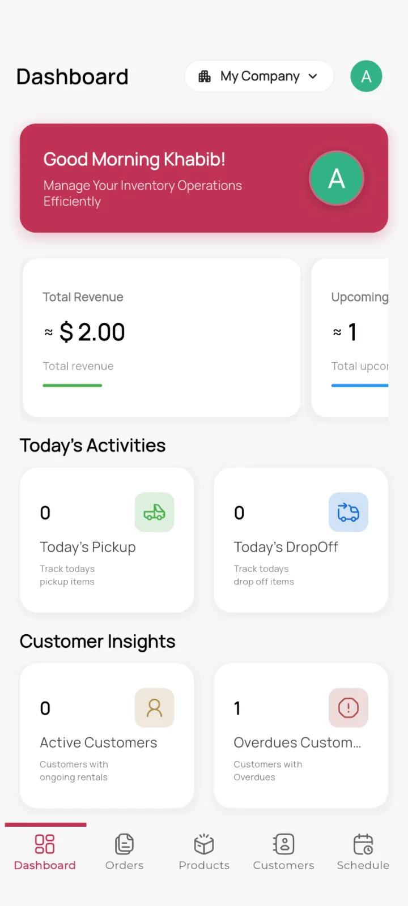
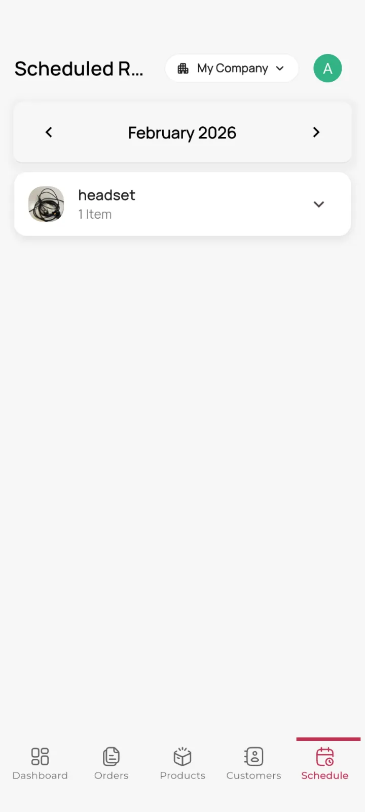
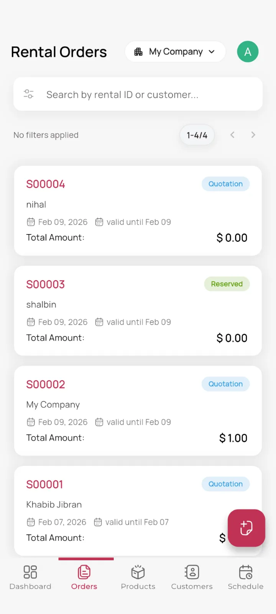
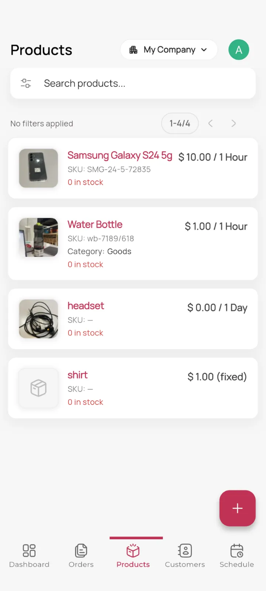

# Mobo Rental


Mobo Rental is a feature-rich mobile application built on top of Odoo's Rental module, empowering businesses to manage their entire rental lifecycle from a sleek, intuitive Flutter interface. From browsing available products and scheduling rentals to tracking active orders and managing customer details, Mobo Rental keeps your rental operations running smoothly — right from your pocket.

##  Key Features

###  Rental Order Management
- **Full Order Lifecycle**: Create, confirm, pick up, and return rental orders directly from the app.
- **Order Tracking**: Monitor the status of every rental order — from draft to closed — in real time.
- **Digital Signatures**: Capture customer signatures within the app for contractual agreements.
- **Detailed Order Forms**: View and manage all order details including scheduled dates, pricing, and customer information.

###  Product & Availability
- **Product Catalog**: Browse the full catalog of rentable products with images, descriptions, and pricing.
- **Real-Time Availability**: Check product availability and rental pricing before confirming an order.
- **Barcode Support**: Scan product barcodes for quick lookup and order creation.
- **Carousel Product View**: Visual image carousels for an engaging product browsing experience.

###  Customer Management
- **Customer Profiles**: View and search customer records synced directly from Odoo.
- **Linked Orders**: Quickly access all rental orders associated with a specific customer.
- **Smart Search**: Typeahead search to quickly find customers by name, email, or phone.

###  Schedule & Planning
- **Rental Scheduling**: Schedule rental pickups and returns with date-time pickers.
- **Map Integration**: View rental locations on an interactive map powered by Flutter Map and Geolocator.
- **Location Picker**: Pinpoint delivery and pickup locations directly on the map.

###  Dashboard & Analytics
- **Rental Insights**: At-a-glance overview of rental performance with charts and KPIs.
- **Revenue Tracking**: Monitor revenue trends using fl_chart-powered visualizations.
- **Status Summary**: Quick summary of orders in each stage (draft, confirmed, in progress, returned).

###  Security & User Experience
- **Biometric Authentication**: Secure and fast login using fingerprint or Face ID.
- **Offline Capabilities**: Continue working without an internet connection, with data syncing automatically when back online.
- **Multi-Company Support**: Easily switch between different company profiles and Odoo databases.
- **Dark Mode**: Fully optimized dark theme for comfortable usage in low-light environments.
- **In-App Review**: Prompt users for app store feedback at the right moment.

##  Screenshots


<div>
  
  
  
  
</div>


##  Technology Stack

Mobo Rental is built using modern technologies to ensure reliability and performance:

- **Frontend**: Flutter (Dart)
- **State Management**: Provider
- **Local Database**: Isar (High-performance NoSQL database)
- **Backend Integration**: Odoo RPC
- **Navigation**: Flutter Navigator with GoRouter-style structure
- **Authentication**: Local Auth (Biometrics) & Odoo Session Management
- **Maps**: Flutter Map + Geolocator
- **Charts**: fl_chart
- **Reporting**: PDF sharing via Share Plus & Open Filex
- **Signature Capture**: Signature package
- **In-App Browser**: Flutter InAppWebView / WebView Flutter

##  Getting Started

### Prerequisites
- Flutter SDK (Latest Stable)
- Odoo Instance (v17 or higher recommended, Rental module enabled)
- Android Studio or VS Code

### Installation

1. **Clone the repository**
   ```bash
   git clone https://github.com/mobo-open-source/mobo_rental.git
   cd mobo_rental_app
   ```

2. **Install dependencies**
   ```bash
   flutter pub get
   ```

3. **Generate code bindings**
   Run the build runner to generate necessary code for Isar and JSON serialization:
   ```bash
   dart run build_runner build --delete-conflicting-outputs
   ```

4. **Run the application**
   ```bash
   flutter run
   ```

##  Configuration

1. **Server Connection**: Upon first launch, enter your Odoo server URL and database name.
2. **Authentication**: Log in using your Odoo credentials. You can enable biometric login in the settings for faster access.
3. **Rental Module**: Ensure the Rental module is installed and configured on your Odoo instance before connecting.

##  Permissions

The app may request the following device permissions:

| Permission | Purpose |
|---|---|
| **Internet** | Sync data with the Odoo server |
| **Camera** | Scan barcodes for product lookup |
| **Location** | Map-based rental location picking |
| **Storage / Files** | Cache images and downloaded reports |
| **Biometrics** | Fingerprint / Face ID authentication |

##  Build Release

### Android
```bash
flutter build apk --release
```
The APK will be generated at `build/app/outputs/flutter-apk/app-release.apk`.

For an App Bundle (recommended for Play Store):
```bash
flutter build appbundle --release
```

### iOS
```bash
flutter build ios --release
```
Open `ios/Runner.xcworkspace` in Xcode to archive and distribute.

##  Usage

1. Launch the **Mobo Rental** app on your device.
2. Enter your **Odoo server URL** (e.g., `https://your-odoo-domain.com`).
3. Select your **database** from the dropdown list.
4. Log in with your **Odoo credentials**.
5. Enable **biometric login** (optional) in Settings for faster access.
6. Browse **Rental Products**, create orders, confirm pickups, and process returns — all from the app.

##  Troubleshooting

### Login Failed
- Double-check your server URL (include `https://`).
- Verify the database name is correct.
- Ensure the user account has access to the Rental module in Odoo.

### No Data Loading
- Check your internet / VPN connection.
- Verify Odoo API access is enabled.
- Confirm the Rental module is installed on the Odoo instance.
- Review server logs for any access or permission errors.

### Biometric Login Not Working
- Ensure biometrics are enrolled on the device.
- Re-enable biometric login in the app Settings.

### Map / Location Not Loading
- Grant Location permission to the app in device Settings.
- Ensure GPS is enabled on the device.

##  Roadmap

- [ ] **Invoice & Payment Tracking** — View and manage Odoo invoices linked to rental orders directly in-app
- [ ] **Product Availability Calendar** — Visual calendar to check rental product availability before booking
- [ ] **Advanced Dashboard Analytics** — Enhanced charts and KPIs for revenue, utilisation rates, and late returns
- [ ] **Barcode / QR Scan in Order Creation** — Extend the existing scanner to create/look up rental orders from product barcodes
- [ ] **Signed Contract Sharing** — Share signed rental contracts (PDF + signature) via email or WhatsApp after confirmation
- [ ] **Multi-Currency Support** — Full currency selection and display aligned with Odoo's multi-currency rental pricing

##  Maintainers

Developed and maintained by **Team Mobo** at [Cybrosys Technologies](https://www.cybrosys.com).

📧 [mobo@cybrosys.com](mailto:mobo@cybrosys.com)

##  Contributing

We welcome contributions to improve Mobo Rental!
1. Fork the project.
2. Create your feature branch (`git checkout -b feature/NewFeature`).
3. Commit your changes (`git commit -m 'Add NewFeature'`).
4. Push to the branch (`git push origin feature/NewFeature`).
5. Open a Pull Request.

##  License

This project is primarily licensed under the **Apache License 2.0**.  
It also includes third-party components licensed under:
- **MIT License**
- **GNU Lesser General Public License (LGPL)**

See the [LICENSE](LICENSE) file for the main license and [THIRD_PARTY_LICENSES.md](THIRD_PARTY_LICENSES.md) for details on included dependencies and their respective licenses.
